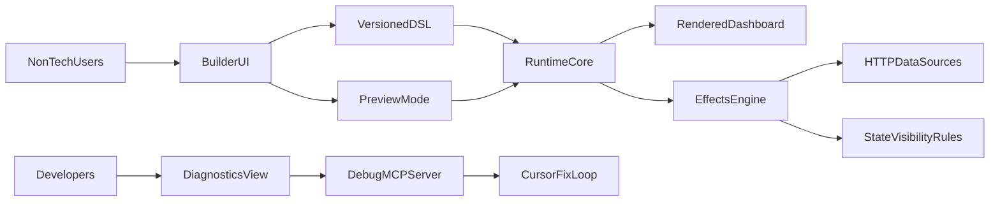

# AIUI Product Plan - Non-Technical Dashboard Builder

## Product goal

AIUI is a visual dashboard operating system for non-technical users.
Users drag and drop components, connect data and side effects, and publish working dashboards without writing code.

## Refactor status (2026-03-31)

- Completed aggressive architecture cleanup baseline across builder/runtime/schema layers.
- Builder now uses extracted feature modules for shortcuts and tree rendering.
- Document/selection coupling reduced via explicit selection reconciliation API.
- Runtime gained `relayout()` to avoid state reset during resize-driven layout changes.
- Shared logic/expression safety and truthiness primitives are consolidated.
- Registry now exposes capability metadata contract for future adapter expansion.
- Runtime diagnostics envelope is formalized and connected to render-time failures.

## Core principles

- Creator canvas and generated runtime must use the same rendering pipeline.
- Preview is a mode toggle, not a second renderer.
- UX is progressive: simple mode first, advanced mode optional.
- Responsive by default; fixed width and height only when explicitly chosen.
- End-user mode hides technical noise (ids, raw schema, internal traces).
- Shadcn is the primary component library in current scope.
- Future UI libraries can be supported only through adapter contracts.

## Target architecture

## Roadmap and phase gates

### Phase 0 - Documentation reset and simplification

**Goal**
- Create one canonical product narrative and remove stale planning noise.

**Deliverables**
- `PLAN.md` rewritten around product principles, phases, and acceptance gates.
- `TODO.md` mapped to actionable phase tasks.
- `cursor.md` updated with durable operating conventions.
- `core.md` summarized to strategic constraints only.

**Gate**
- All planning documents are aligned and non-duplicative.

---

### Phase 1 - No-code UX foundation (shadcn-first)

**Goal**
- A first-time non-technical user can assemble a basic dashboard without JSON.

**Scope**
- Component palette from registry metadata (labels, categories, searchable keywords).
- Drag/drop placement with clear insert, nest, and reorder affordances.
- Beginner inspector sections:
  - Content
  - Data
  - Actions
  - Visibility
  - Layout
  - Style
  - Accessibility
- Smart starter defaults for:
  - Table
  - Button
  - Card
  - Filter controls
  - Basic chart placeholder

**APIs and abstractions**
- Registry metadata contract for non-technical editing UX.
- Primitive property editor components shared across all widgets.

**Risks**
- Too much information in inspector can overwhelm new users.
- Inconsistent defaults across components can break trust.

**Acceptance gate**
- New user creates a simple header + table + button dashboard without raw JSON.
- Status: In progress with builder decomposition and UX command-path cleanup.

---

### Phase 2 - Responsive layout and visual constraints

**Goal**
- Dashboards adapt across viewport sizes by default.

**Scope**
- Layout tokens for stack/grid responsiveness, wrapping, min/max constraints.
- Viewport presets for desktop/tablet/mobile with overflow warnings.
- Guidance to prefer content-based sizing over fixed values.

**APIs and abstractions**
- DSL layout constraints that avoid hardcoded dimensions unless explicit.
- Shared viewport simulation controls in editor/preview.

**Risks**
- Overly complex constraints can confuse non-technical users.
- Divergence between editor width simulation and runtime container width.

**Acceptance gate**
- Same dashboard layout remains usable across all presets with no manual rewiring.

---

### Phase 3 - Universal properties and data binding

**Goal**
- Any component can use a consistent binding model.

**Scope**
- Property binding modes:
  - Static value
  - Expression
  - State path
  - Query result path
- Data source picker with path browser and sample-data feedback.
- Reusable prop editors so newly added components automatically inherit UX.

**APIs and abstractions**
- Binding descriptor schema in DSL.
- Component capability map for bindable properties.

**Risks**
- Ambiguous data paths reduce confidence.
- Mixed value types can produce hard-to-understand runtime errors.

**Acceptance gate**
- Table rows, button text, modal visibility/content are bound through one unified model.

---

### Phase 4 - Side effects and workflow orchestration (React Flow)

**Goal**
- Complex behavior is configurable visually, no coding required.

**Scope**
- Dual editing modes:
  - Simple mode: wizard/action-list for common flows
  - Flow mode: React Flow for branching and advanced logic
- Action blocks:
  - Fetch
  - Set state
  - Transform
  - Condition
  - Open modal
  - Close modal
  - Notify
  - Navigate
- Guided templates:
  - Button click -> fetch data -> populate table
  - Row action -> open modal -> submit -> refresh table
- Visibility/interactivity rule builder:
  - Show/hide
  - Enable/disable
  - Rules by state, data, role

**APIs and abstractions**
- Action DSL with deterministic execution order.
- React Flow projection generated from action graph model.

**Risks**
- Editing in two modes can cause synchronization drift if not single-source.

**Acceptance gate**
- Both guided scenario templates are fully configurable through UI only.

---

### Phase 5 - Runtime parity and preview contract

**Goal**
- No mismatch between builder canvas, preview, and exported runtime.

**Scope**
- Formal parity contract:
  - same DSL
  - same viewport
  - same data snapshot
  - same behavior/layout output
- Preview button toggles runtime-only view without editor chrome.
- Visual parity regression suite and high-priority interaction snapshots.

**APIs and abstractions**
- Shared renderer path for create/edit/preview/export runtime.

**Risks**
- Any fallback renderer in builder can silently drift from runtime semantics.

**Acceptance gate**
- Parity tests pass for all critical components and key interactions.
- Status: Improved with `relayout()` path and runtime state preservation test.

---

### Phase 6 - Extensible component-library strategy

**Goal**
- Keep current shadcn velocity while preparing for future library adapters.

**Scope**
- Maintain shadcn as only production library in current implementation.
- Introduce adapter boundaries for future MUI/Ant/custom components.
- Define capability schema:
  - supportsDataSource
  - supportsActions
  - supportsRowActions
  - supportsVisibilityRules
  - supportedLayoutModes
- Certification checklist before exposing a component to end users.

**APIs and abstractions**
- Registry adapter interface and capability validation.

**Risks**
- Mixing multiple libraries too early harms UX consistency and supportability.

**Acceptance gate**
- New components are onboarded by metadata and adapter compliance, not one-off editor coding.
- Status: Capability metadata scaffold added in registry.

---

### Phase 7 - Developer diagnostics and Cursor MCP

**Goal**
- End users remain shielded from complexity while developers debug quickly.

**Scope**
- Diagnostic stream from builder/runtime:
  - action traces
  - binding failures
  - schema violations
  - performance warnings
- MCP contract for Cursor automation:
  - `list_issues`
  - `get_issue_context`
  - `suggest_fix`
  - `apply_safe_fix_patch`
  - `validate_fix`
- Safety controls:
  - data redaction
  - patch safety checks
  - scope-limited fixes
- Split UX:
  - user-friendly issue messages in product UI
  - deep traces only in developer diagnostics surface

**APIs and abstractions**
- Standardized issue envelope shared by runtime, builder, and MCP server.

**Risks**
- Overly broad auto-fix capability can introduce unsafe code changes.

**Acceptance gate**
- Developers can inspect and resolve common issues through MCP-guided workflows.
- Status: Runtime diagnostics envelope (`code`, `source`, `severity`, `summary`) wired.

---

### Phase 8 - Adoption hardening and UX polish

**Goal**
- Production readiness for non-technical teams at scale.

**Scope**
- Guided onboarding and template-driven starts.
- Migration assistant for older DSL versions.
- Performance hardening for large dashboards.
- Accessibility and i18n readiness pass.

**Acceptance gate**
- First-time users can publish confidently; large dashboards stay stable and responsive.

## Detailed execution policy per phase

After each completed phase:

1. Update `PLAN.md`:
   - status
   - design decisions
   - architecture deltas
   - next-phase gates
2. Update `TODO.md`:
   - remove completed tasks
   - add discovered follow-ups
   - re-prioritize pending work
3. Update `cursor.md`:
   - durable lessons and conventions
4. Update `core.md`:
   - keep strategic constraints only
   - summarize stale context
5. If phase includes diagnostics/MCP updates:
   - update `docs/mcp/debug-mcp-spec.md` versioned schema and examples

## Build-first vs defer

**Build first**
- Non-technical UX flow
- Responsive layout defaults
- Unified binding model
- Side effects templates with React Flow support
- Runtime parity enforcement

**Defer**
- Multi-library production rollout
- AI generation features
- Marketplace/plugin ecosystem

## Success criteria

- Non-technical users can build:
  - data-driven table dashboard
  - button-triggered fetch and populate flow
  - row-action modal workflow with post-submit refresh
- Creator, preview, and exported runtime stay behaviorally identical.
- Developers can debug quickly through diagnostics + MCP without exposing technical complexity to end users.
