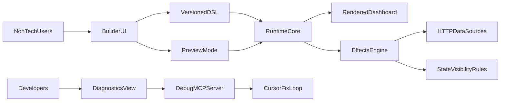

# AIUI — Product plan

## Product goal

AIUI is a visual dashboard OS for non-technical users: drag and drop, connect data and side effects, publish without code.

## Refactor status (2026-03-31)

Baseline cleanup across builder, runtime, schema, registry; shared shortcuts/tree modules; runtime `relayout()`; consolidated logic/expression helpers; registry capability contract; runtime diagnostics envelope.

**Screen graph (2026-03-31):** DSL supports multiple `screens` and a React Flow `flowLayout` (positions + prototype edges); runtime routes with `navigateScreen` and a modal overlay stack; builder edits one screen at a time via `activeScreenId` while the graph shows all screens.

## Core principles

- Creator canvas and generated runtime share one rendering pipeline.
- Preview is a mode, not a second renderer.
- Progressive UX: simple first, advanced optional (`?dev=1` on builder/preview).
- Responsive by default; fixed width/height only when explicit.
- End-user mode hides technical noise (raw ids, schema dumps).
- shadcn-first in current scope; other libraries via adapter contract only.

## Target architecture

## Phases (summary)

| Phase | Focus | Gate (short) |
|-------|--------|----------------|
| 0 | Docs: one narrative, phase-gated TODO | Plans aligned, no duplicate sources of truth |
| 1 | No-code UX: palette, DnD, inspector, templates | Basic dashboard without JSON |
| 2 | Responsive layout, viewport presets, overflow guidance | Usable across desktop/tablet/mobile presets |
| 3 | Bindings: static, expression, state, query | Unified binding model for props and visibility |
| 4 | Actions: simple list + React Flow advanced, templates | Templates fully UI-editable |
| 5 | Parity: same DSL + viewport + renderer path | Parity tests + dev diagnostics |
| 6 | Adapter contract + certification for new components | Onboard via metadata, not ad-hoc app code |
| 7 | Diagnostics + MCP (`docs/mcp/debug-mcp-spec.md`) | MCP-guided inspect/fix with redaction |
| 8 | Onboarding, migration, perf, a11y, i18n | First-time publish path + large-doc stability |

## Execution policy

After a phase milestone: update `TODO.md` (remove done, add follow-ups), append durable notes to `cursor.md`, keep `core.md` to strategic constraints only; bump MCP spec version when tools/envelopes change.

## Build first vs defer

**Build first:** non-technical UX, responsive defaults, unified bindings, action templates + Flow, runtime parity.

**Defer:** multi-library production mix, AI generation, marketplace/plugins.

## Success criteria

- Non-technical users ship: data table UI, fetch→populate flow, row-action modal→refresh flow.
- Builder, preview, export use the same runtime path.
- Developers debug via diagnostics + MCP without exposing internals to end users.
