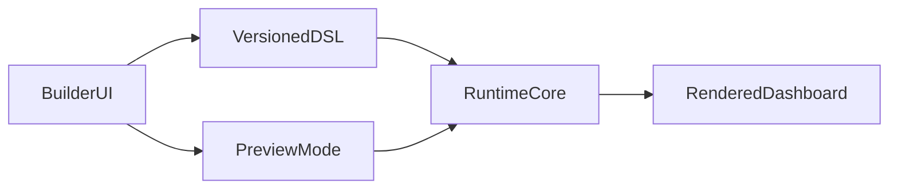

# AIUI — Product plan

## North star (2026-04)

AIUI is a **visual dashboard builder** that mirrors how frontend developers ship dashboards: **structure and layout**, then **state and data**, then **binding data to UI**, then **side effects and CTAs**. The builder should feel like composing a real page—not juggling two different visual languages.

**Single-page focus:** Treat the **main builder workspace as one page**. The **React Flow canvas occupies the full window** (or the full primary workspace region): users **drag and drop** registered UI primitives onto that canvas to build structure. **Preview must show exactly the same output** as the canvas runtime path (same subtree, same `RuntimeSurface`, same viewport rules). There is no separate “page preview” that diverges from the editor.

This direction **simplifies** the product: fewer panels, fewer redundant fields, and **defaults supplied at drop time** (registry-defined props and layout hints) that users refine in a focused inspector.

> **Note on the existing codebase:** The repo already contains multi-screen graphs, `flowLayout`, and screen-to-screen navigation. That work remains available as an **advanced / deferred** track. The phased plan below **prioritizes** single-page, full-canvas DnD and preview parity first; multi-screen can be reintroduced as an optional layer once the one-page story is crisp.

---

## How this maps to a developer’s workflow

| Layer | What the user does in AIUI | Product implication |
|--------|----------------------------|----------------------|
| **1. Layout & structure** | Drag components from the palette onto the React Flow canvas; arrange, nest, resize | Canvas = authoritative structure; React Flow is the spatial editor for the page tree |
| **2. State & data** | Define document state, data sources, and fetch/transform steps | Same DSL/state model as today; UX grouped and trimmed to essentials |
| **3. Link data to UI** | Bind props and visibility to state, queries, expressions | One binding model; inspector surfaces only what the selected node needs |
| **4. Side effects & CTAs** | Buttons, row actions, navigation, modals, notifications | Action lists + optional advanced flow visualization behind progressive disclosure |

---

## Core principles

- **Parity by default:** Whatever renders on the **canvas** (in “edit” mode) must match **Preview** pixel- and behavior-wise for the same document and viewport. Preview is a **mode**, not a second renderer.
- **One page, one graph:** The primary surface is **one page’s component tree** laid out on React Flow. Avoid splitting “design” and “preview” into different layout engines.
- **Progressive disclosure:** Simple controls first; JSON, deep diagnostics, and secondary graphs (`?dev=1`) optional.
- **Drop-time intelligence:** When a component is dropped, apply **registry-defined default props** (and sensible layout) so the user configures deltas, not empty shells.
- **shadcn-first** for the current component set; other libraries via adapter contracts later.

---

## Target architecture (unchanged at the core)

The **change** is **where** composition happens (full-window React Flow as the page canvas) and **strict parity** between that path and preview.

---

## Phased roadmap (execute in order)

Each phase has a **gate**: ship documentation or behavior that proves the milestone before heavy investment in the next.

### Phase 0 — Plan alignment and scope freeze

- **Goal:** One narrative in this file + `TODO.md` + `core.md`; no competing “source of truth” for the new direction.
- **Gate:** Stakeholders agree: single-page primary, React Flow = page canvas, preview parity non-negotiable; multi-screen deferred.

### Phase 1 — Full-window page canvas (structure)

- **Goal:** Builder’s **primary workspace** is **React Flow filling the available area** (with palette and minimal global chrome). **Drag from palette → drop on canvas** creates/nodes the UI tree (dnd-kit + React Flow integration as today, but **layout and prominence** match the north star).
- **Gate:** A non-developer can build a simple dashboard **only** via DnD on the big canvas (no reliance on a separate “hidden” tree editor for basic structure).

### Phase 2 — Preview parity hard gate

- **Goal:** **Remove or reconcile any UI path** that renders the document differently from Preview. Same document JSON → same `RuntimeSurface` output for canvas and preview at matched viewport.
- **Gate:** Checklist or automated smoke: N representative documents, **canvas vs preview** indistinguishable aside from edit chrome (selection outlines, handles).

### Phase 3 — Simplify surfaces: props on drop + lean inspector

- **Goal:** **Drop-time defaults** from `@aiui/registry` (and small app-level helpers where needed). **Inspector** shows only **sections relevant** to the selected node; **remove redundant fields** and duplicate controls discovered by audit.
- **Gate:** Component count × “avg clicks to first meaningful config” improves vs baseline (qualitative + short internal script if available).

### Phase 4 — State and data (authoring UX)

- **Goal:** Clear, minimal flows for **document state** and **data fetching** aligned with the four-layer table above (no duplicate panels saying the same thing).
- **Gate:** “Fetch → table” and “button → set state” flows completable without JSON for the happy path.

### Phase 5 — Bindings (unified)

- **Goal:** One binding descriptor model wired through inspector and runtime; sample/preview of bound values where applicable.
- **Gate:** Bindings round-trip in export; runtime tests cover static, state, and expression modes used in templates.

### Phase 6 — Actions, side effects, and CTAs

- **Goal:** Action lists, templates, visibility rules; **advanced** React Flow logic map remains **optional** (`?dev=1` or equivalent), not required for basic dashboards.
- **Gate:** Row action → modal → submit → refresh scenario works end-to-end in builder + preview.

### Phase 7 — Hardening and developer experience

- **Goal:** Diagnostics, MCP alignment, i18n keys, a11y passes, large-document behavior, performance budgets.
- **Gate:** `pnpm test` green; documented limits; MCP spec version bumped only if envelopes change.

### Phase 8+ — Optional: multi-screen graph and navigation

- **Goal:** Reconcile **screen graph** and **per-screen canvases** with the single-page clarity achieved in Phases 0–7: either a **clear mode switch** or a **second-tier** entry for multi-page apps.
- **Gate:** Users who only need one page never pay complexity tax.

---

## Execution policy

- After each phase: update `TODO.md` (done vs new gaps), append durable notes to `cursor.md`, keep `core.md` strategically short.
- **Do not** expand scope with AI generation, plugins, or multi-library production mix until Phases 1–7 gates are met.

---

## Success criteria (product)

- A user can build a **data-backed dashboard** (layout + fetch + bind + actions) **primarily** via **drag-and-drop on the full React Flow canvas** and a **minimal inspector**.
- **Preview** is trusted: **what you see while editing is what you ship**.
- Developers can still debug via diagnostics and MCP without exposing internals to end users.

---

## Legacy roadmap (completed pre–2026-04 pivot)

Phases **0–8** of the earlier roadmap (registry, layout engine, bindings, actions, parity tests, adapters, diagnostics MCP, onboarding/i18n) **shipped** and underpin the runtime and builder. The **phased roadmap above** is the **forward-looking** plan; it **re-centers UX** on single-page, full-canvas DnD and strict preview parity rather than replacing the underlying packages.
